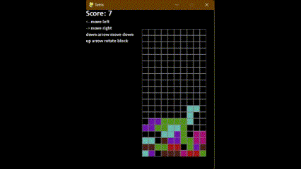

# Tetris Game

This is an implementation of the classic Tetris game using Python and Pygame library.



## Features

- Control the falling blocks using arrow keys: Left, Right, Up to rotate, Down to accelerate, Space to drop instantly.
- Score calculation based on lines cleared.
- Game over detection.
- Restart the game by pressing ESC key.

## Requirements

- Python 3.8
- Pygame library

## Installation

1. Clone the repository:

    ```
    git clone https://github.com/cy6e/tetris.git
    ```

2. Install Pygame library if you haven't already:

    ```
    pip install pygame
    ```

## Usage

Run the `tetris.py` file:

```
python tetris.py
```
